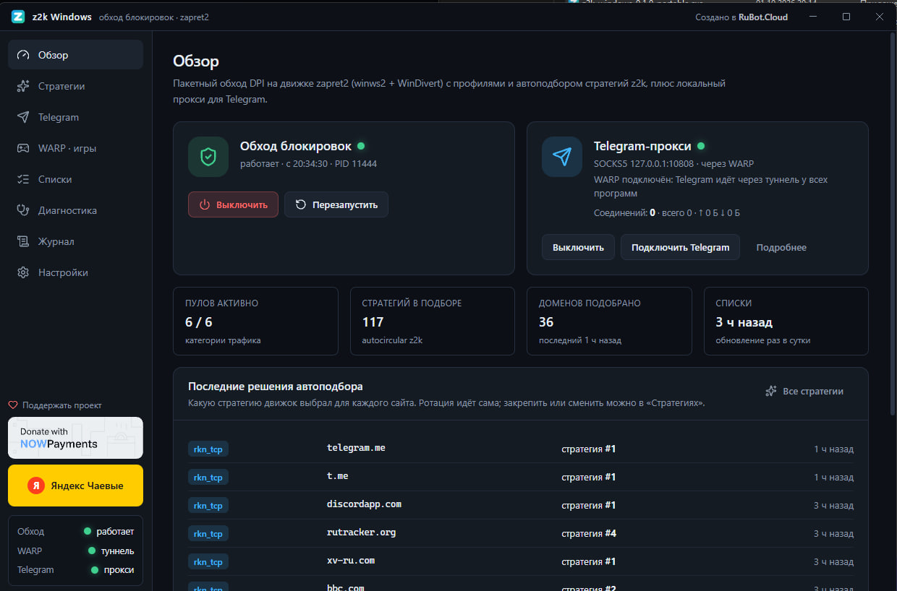

# z2k Windows

Приложение для Windows 10/11, которое помогает открывать сайты, YouTube и Discord, когда провайдер их замедляет или блокирует. Основано на проектах [z2k](https://github.com/necronicle/z2k) и [zapret2](https://github.com/bol-van/zapret2).



## Возможности

- **Обход в один клик.** Включаете на главном экране — работает для всех программ на компьютере.
- **Автоподбор.** Программа сама подбирает рабочий способ для каждого сайта и запоминает его.
- **YouTube и Discord.** Отдельные настройки для видео, сайтов и голосовых звонков Discord.
- **Свои списки.** Можно добавить сайты для обхода и исключить те, что трогать не нужно (банки, госуслуги).
- **DNS через DoH.** Пока работает обход, DNS идёт по защищённому каналу. После выключения настройки сети возвращаются как были.
- **Игровой режим WARP.** Трафик выбранных игр идёт через Cloudflare WARP, остальной — напрямую. Поддерживается ключ WARP+.
- **Диагностика.** Проверка сайта по шагам и подсказки, что мешает.
- **Работа в трее** и автозапуск вместе с Windows.

## Как запустить

1. Скачайте `z2k-windows-<версия>-portable.exe` со страницы [Releases](https://github.com/fortekdev/z2k-windows/releases/latest) и запустите. Установка не нужна.
2. Подтвердите запуск от имени администратора — без этого обход работать не сможет.
3. На главном экране нажмите **«Включить обход»**.

Если сайт не открылся сразу, обновите страницу пару раз: программе нужно несколько попыток, чтобы подобрать способ.

## Если что-то не работает

- Откройте раздел **«Диагностика»**, введите адрес сайта и нажмите «Проверить» — программа покажет, на каком шаге проблема.
- Сайта нет в списках? Добавьте его в **«Списки → Свои домены»**.
- Сайт сломался из-за программы? Добавьте его в **«Списки → Исключения»**.
- Включён VPN? С ним обход не нужен. После выключения VPN нажмите **«Стратегии → Сбросить»**.
- Антивирус может предупреждать о драйвере WinDivert: он нужен программе для работы с сетевыми пакетами.

### «Без доступа к интернету», когда программа закрыта

Пока работает обход, программа направляет DNS компьютера через себя (настройка «DNS через DoH»). В версиях до 0.1.1 при выключении компьютера с запущенной программой, сбое или закрытии через «Снять задачу» эта настройка могла остаться. Тогда Wi-Fi подключён, но сайты не открываются, пока программа снова не запущена.

В новых версиях настройка возвращается сама — при любом закрытии программы и при загрузке Windows. Если проблема уже случилась, исправьте одним из способов:

- **Проще всего:** запустите программу и закройте её через значок в трее → «Выход». Настройки DNS вернутся.
- **Без программы:** откройте PowerShell **от имени администратора** и выполните:
  ```powershell
  Get-NetAdapter | ForEach-Object { Set-DnsClientServerAddress -InterfaceIndex $_.ifIndex -ResetServerAddresses }
  ```
  Команда вернёт всем адаптерам получение DNS автоматически (от роутера).
- **Вручную:** Параметры → Сеть и Интернет → ваш Wi-Fi → «Назначение DNS-сервера» → «Изменить» → «Автоматически (DHCP)».

Если до программы у вас были свои DNS-серверы (например, 8.8.8.8), после этого впишите их заново. Отключить переключение DNS совсем можно в программе: **«Настройки → DNS»**.

## Где хранятся настройки

Все настройки и списки лежат в `C:\ProgramData\z2k-windows`. Сам exe можно перемещать или заменять новой версией — настройки сохранятся.

## Поддержать проект

Кнопки доната (криптовалюта через NOWPayments и Яндекс Чаевые) есть в самой программе: на главном экране и в боковом меню.

## Для разработчиков

Нужны Node.js 22+ и Git for Windows. Запускать от имени администратора.

```bash
npm install
npm run fetch:engine   # движок zapret2, списки, профили z2k
npm run build:warpd    # движок WARP
npm run dev            # запуск в режиме разработки (или F5 в VS Code)
npm test               # тесты
npm run build          # портативная сборка в release/
npm run release        # новая версия (0.1.0 → 0.1.1), сборка на GitHub Actions и публикация в Releases
```

Стек: Electron, Next.js, React, TypeScript.

## Лицензии

Код приложения — MIT. Используются: z2k и zapret2 (MIT), WinDivert и cygwin1.dll (LGPLv3), wireguard-go (MIT), Wintun (лицензия WireGuard LLC).

---

Создано в **RuBot.Cloud**
